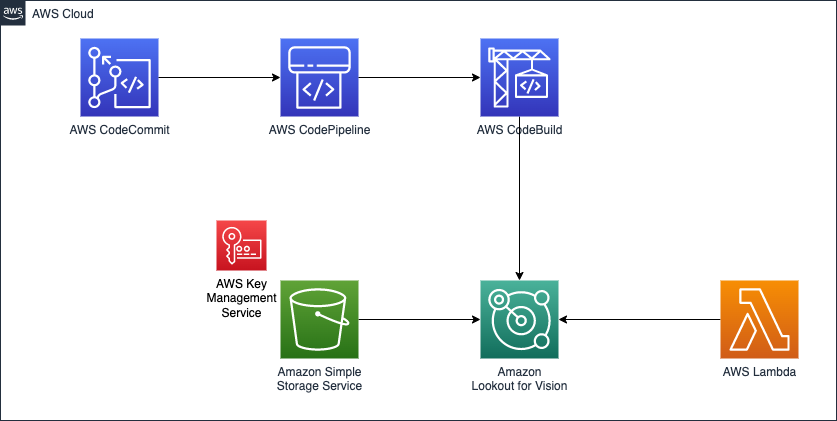

# Automate Amazon Lookout for Vision training and deployment for Silicon Wafer Anomaly Detection


## Table of Contents

- [Overview](#overview)
- [Installation](#installation)
- [Documentation](#documentation)

   - [Build, train, and deploy Amazon Lookout for Vision models using the Python SDK](https://aws.amazon.com/blogs/opensource/build-train-and-deploy-amazon-lookout-for-vision-models-using-the-python-sdk/)
   - [Build an event-based tracking solution using Amazon Lookout for Vision](https://aws.amazon.com/blogs/machine-learning/build-an-event-based-tracking-solution-using-amazon-lookout-for-vision/)
   - [Amazon Lookout for Vision Python SDK: Cross-validation and Integration with Other AWS Services](https://aws.amazon.com/blogs/opensource/how-to-use-the-open-source-amazon-lookout-for-vision-python-sdk/)
   - [Getting started with Amazon Lookout for Vision](https://aws.amazon.com/lookout-for-vision/)

- [Contributing](#contributing)
- [License](#license)

## Overview
In this solution we will demonstrate how companies can automate training and deployment of *[Amazon Lookout for Vision](https://aws.amazon.com/lookout-for-vision/)* machine learning (ML) models and operationalize visual inspection. We will focus on anomaly detection of silicon wafers, but the solution can be applied to any other product or industry. According to [TSMC](https://www.tsmc.com/english/dedicatedFoundry/manufacturing/fab_capacity) their managed facilities and its subsidiaries exceeded 12 million 12-inch equivalent wafers in 2020. In an ideal manufacturing process each of these wafers should pass visual inspection. Often this is either done manually and with sampling, or old legacy tools apply statistical measures in the hope of detecting defects. Considering the above number and extrapolating to the entire semiconductor industry there’s huge potential to improve and automate processes.
Amazon Lookout for Vision eliminates the need for costly and inconsistent manual inspection, while improving quality control, defect and damage assessment, and compliance. In minutes, you can begin using Amazon Lookout for Vision to automate inspection of images and objects - with no ML expertise required.

This solution uses the content of [this](https://github.com/aws-samples/amazon-lookout-for-vision-event-based-tracking) Github repository. The code and use case of this repository is documented in the blog post [Build an event-based tracking solution using Amazon Lookout for Vision](https://aws.amazon.com/blogs/machine-learning/build-an-event-based-tracking-solution-using-amazon-lookout-for-vision/). We have modified the code so that it is automated in a CI/CD pipeline. Further, we use the [open-source Python SDK for Amazon Lookout for Vision](https://github.com/awslabs/amazon-lookout-for-vision-python-sdk) which is explained in [this](https://aws.amazon.com/blogs/opensource/build-train-and-deploy-amazon-lookout-for-vision-models-using-the-python-sdk/) blog post.



This architecture demonstrates how build, train and deployment of Amazon Lookout for Vision models is automated through a CI/CD pipeline. The code is stored in an [Amazon CodeCommit](https://aws.amazon.com/codecommit/) repository. That also enables developers to change the code, change input images or add certain other steps that your automation requires. After deploying the solution or whenever you update the main branch of your CodeCommit repository [Amazon CodePipeline](https://aws.amazon.com/codepipeline/) automatically pulls the code into [Amazon CodeBuild](https://aws.amazon.com/codebuild/). This service then runs train and deploy in a serverless fashion and creates the Amazon Lookout for Vision model for you. This pipeline also enables updating your Lookout for Vision model in case you decide to feed more or other data. The model itself is exposed to end-users through [AWS Lambda](https://aws.amazon.com/lambda/) and [Amazon API Gateway](https://aws.amazon.com/api-gateway/). However, you are not limited to this method. Amazon Lookout for Vision can also be deployed at edge on your IoT device or can be run as batch process on a scheduled basis and generate your predictions.

## Installation

**Supported Python Versions**

This [AWS CDK](https://aws.amazon.com/cdk/) stack was developed using
* Python 3.10

[Download](https://www.python.org/downloads/) it here and install it.

Once you cloned the repository create a virtual environment using

```
python3 -m venv .venv
```

Activate the environment:

```
source .venv/bin/activate
```

Optional: Windows users

```
.venv\Scripts\activate.bat
```

Next install the required libraries using:

```
pip install -r requirements.txt
```

Finally, initialize pre-commit using

```
pre-commit install
```

At this point you can now synthesize the CloudFormation template for this code.

```
cdk synth
```

And of course deploy the stack:

```
cdk deploy --all --require-approval never
```

The `-—all` flag ensures that all components are installed at once. By specifying `-—require-approval` never you won’t need to approve each component to be deployed.

## Documentation

   - [Build, train, and deploy Amazon Lookout for Vision models using the Python SDK](https://aws.amazon.com/blogs/opensource/build-train-and-deploy-amazon-lookout-for-vision-models-using-the-python-sdk/)
   - [Build an event-based tracking solution using Amazon Lookout for Vision](https://aws.amazon.com/blogs/machine-learning/build-an-event-based-tracking-solution-using-amazon-lookout-for-vision/)
   - [Amazon Lookout for Vision Python SDK: Cross-validation and Integration with Other AWS Services](https://aws.amazon.com/blogs/opensource/how-to-use-the-open-source-amazon-lookout-for-vision-python-sdk/)
   - [Getting started with Amazon Lookout for Vision](https://aws.amazon.com/lookout-for-vision/)

## Contributing
If you wish to contribute to the project, please see the [Contribution Guidelines](./CONTRIBUTING.md).

## License

This repository is licensed under the MIT-0 License. It is copyright 2023 Amazon.com, Inc. or its affiliates. All Rights Reserved. The license is available at: http://aws.amazon.com/mit-0
